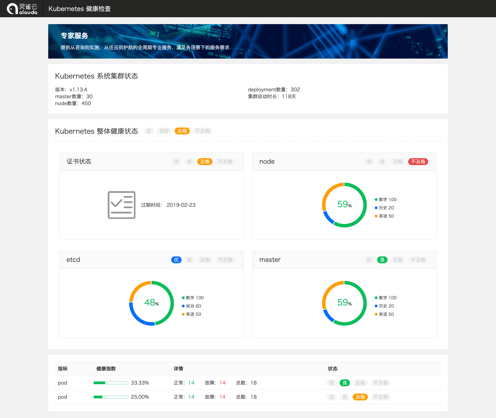

## 介绍

程序分为两个部分：frontend与printer。

frontend是一个健康报告静态展示页，供改造成后端模板。

printer是一个puppeteer打印程序，它的作用是可以将输入的URL指向的页面打印成PDF，这个程序可以被打包成可执行文件（详见下文），从而不需要安装node.js即可直接执行。

## frontend

### 页面预览



### charts.js 使用方式

`charts.js`是基于canvas写的一个图形库，目前仅支持环状图和进度条两种图形。

使用方式如下：

```javascript
new Chart("#node-chart", {
  type: "doughnut",
  legend: ["数学", "历史", "英语"],
  data: [100, 50, 50],
  label: { text: "50%", color: COLORS[1] }
});

new Chart("#etcd-chart", {
  type: "doughnut",
  legend: ["人工智能", "大数据", "前端", "后端"],
  data: [2132, 1247, 3246, 4223],
  label: { text: "34%", color: COLORS[1] }
});

new Chart("#master-chart", {
  type: "doughnut",
  legend: ["Javascript", "Python", "Go"],
  data: [80, 30, 20],
  label: { text: "23%", color: COLORS[1] }
});

new Chart("#bar1", {
  type: "bar",
  data: -1
});

new Chart("#bar2", {
  type: "bar",
  data: 0.7523
});

new Chart("#bar3", {
  type: "bar",
  data: 1.0
});
```

#### Chart 类

```js
new Chart(cssSelector, options)
```

#### doughnut 环形图

- type [string] "doughnut"
- legend [array] 
- data [array]
- label [object]

#### bar 条形图

- type [string] "bar"
- data [number]

## printer

使用的工具

- [puppeteer](https://github.com/shelljs/shelljs)
- [shelljs](https://github.com/shelljs/shelljs)
- [pkg](https://github.com/zeit/pkg)
- [yargs](https://github.com/yargs/yargs)

### install

```shell
$ yarn
```

### 打包

```shel
$ yarn run build
```

### 运行

```shell
$ ./build/ats-macos --target https://www.baidu.com --output ./pdf/ats-reporter.pdf
```

输入`node index.js --help`查看帮助选项。

## 关于页面转化为PDF的方案

目前已有的方案大致分为以下几种：

1. 后端使用专门的工具生成PDF供前端下载（试验过生成word效果不理想，不知道生成PDF效果怎么样）；
2. 前端通过脚本截取页面转化为图片，最终生成pdf（生成的图片比较模糊，影响阅读体验）；
3. 直接在js里编写pdf的内容，然后生成pdf（这种方案需要写大量的代码，而且不能通用，非常浪费时间）；
4. 直接调用`window.print()`，借助浏览器提供的打印功能（这种方式兼容性差，容易样式混乱）。

综上，我采用的是`@media print`结合`puppeteer`的方式，首先使用媒体查询调整打印样式，随后使用[puppeteer](https://github.com/GoogleChrome/puppeteer)生成pdf。